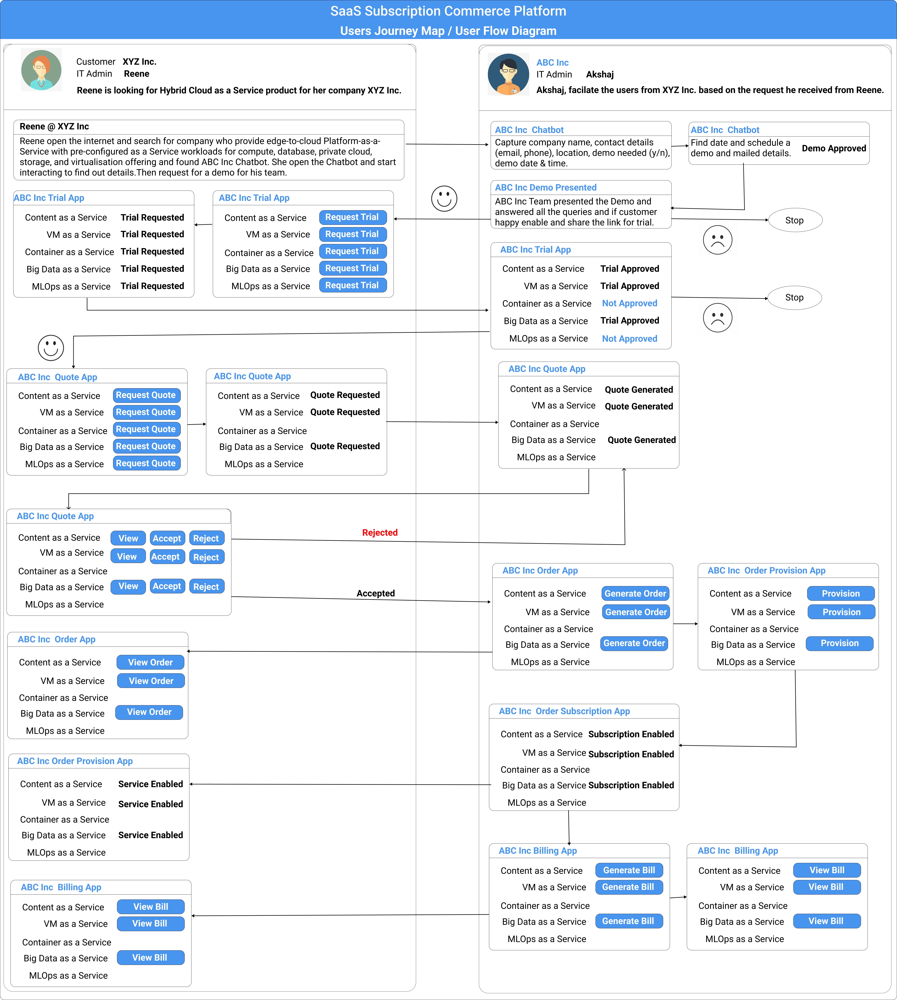
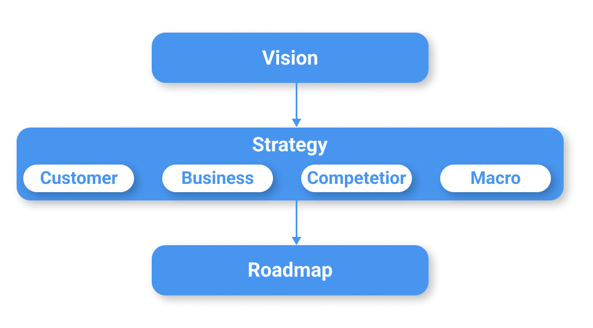
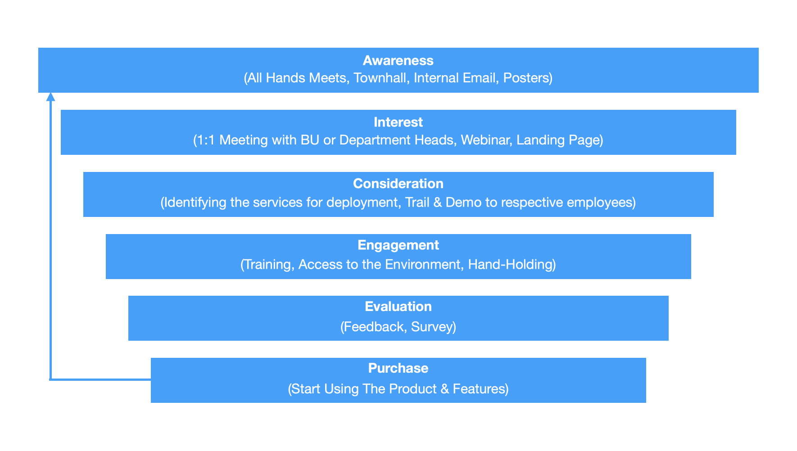
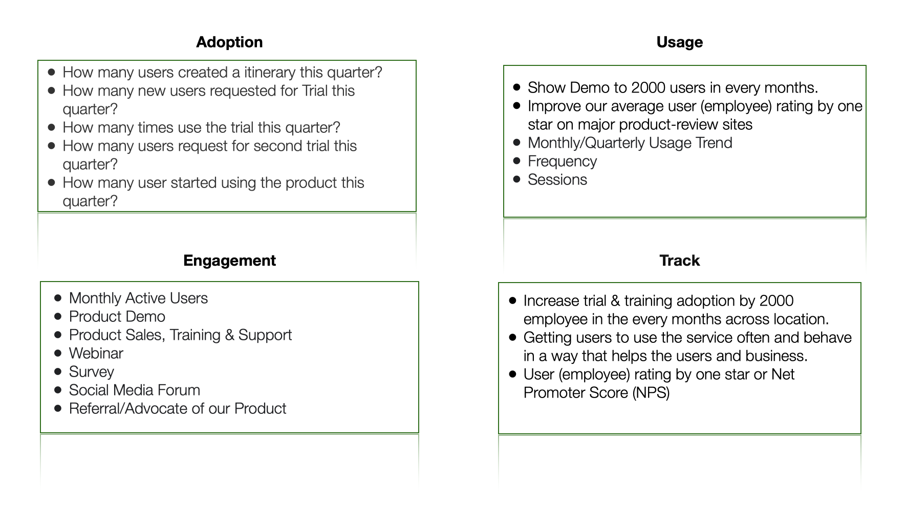
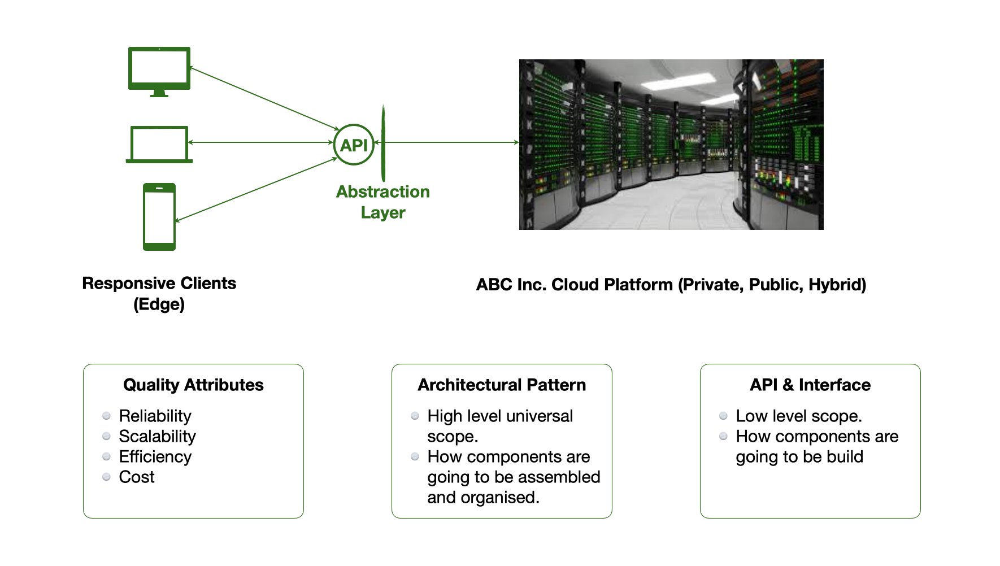
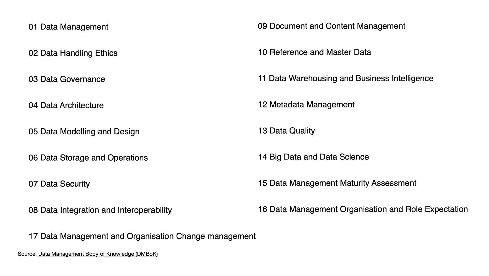
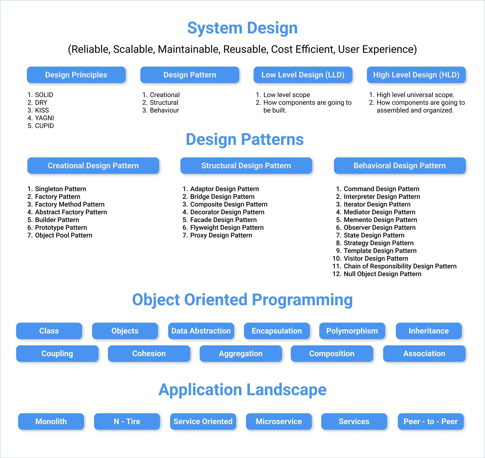
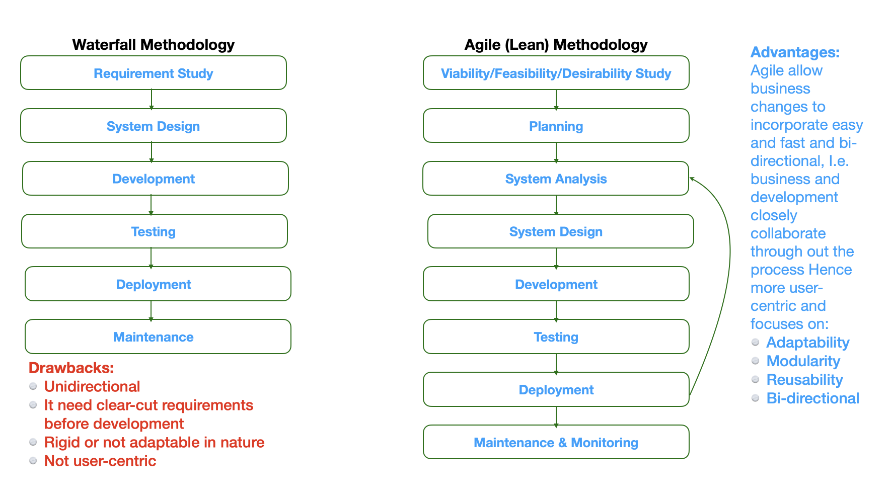
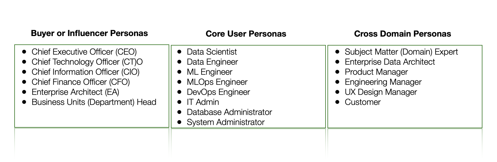

# Problem Statement

We may all agree that clients prefer technology delivered as a Service, but they also expect flexibility. In order to attract and retain customers, stand out from the competition, and increase revenue, businesses today have a fantastic opportunity to embrace digital transformation. In order to achieve this goal, businesses need the capacity to rapidly innovate, the flexibility to select the optimal combination of technologies, and an uniform cloud experience for managing all of their applications and workloads. Sadly, the market isn't being well served by the current paragigm for corporate IT. Customers have to put up with inconsistent service across on-premises data centres and external cloud providers, as well as rigid, costly, and proprietary stacks that limit their options.

# Solution

SaaS Subscription Commerce Platform (SSCP) will be driven by the shift in business models from perpetual product offering to SaaS and Sunscription models, which give customers more freedom of action. Therefore, the Software as a Service (SaaS) subscription model will restructure and revolutionise the market, with a new and improved manner to offer as a service that will re-set the digital opportunity for clients. In order to help its customers lay the proper digital groundwork, SSCP offers a variety of subscription-based, pay-as-you-go as a service products that deliver a uniform cloud environment in which to run their essential operations. In addition, the SSCP's robust CPQ & Q2C, metering and governance features let businesses tune consumption to keep projects on track financially and legally.

# SSCP User Journey Map

# Vision - Strategy - Roadmap

# User Onboarding Strategy

# Key Metrices

# High Level System Design & Architecture

# Data Management Function & Scope

# System Design Principles & Patterns

# Agile Methodology - Adaptive Processes

# Cross - Domain - Personas

# Configuration Price Quote (CPQ)

# Quote to Cash (Q2C) 
